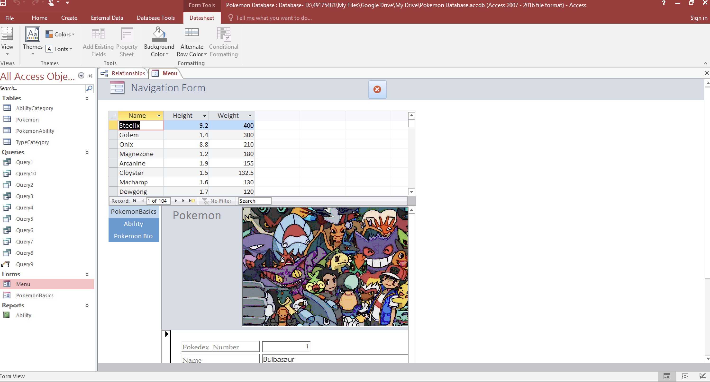
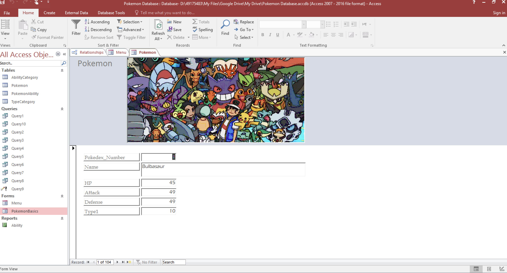
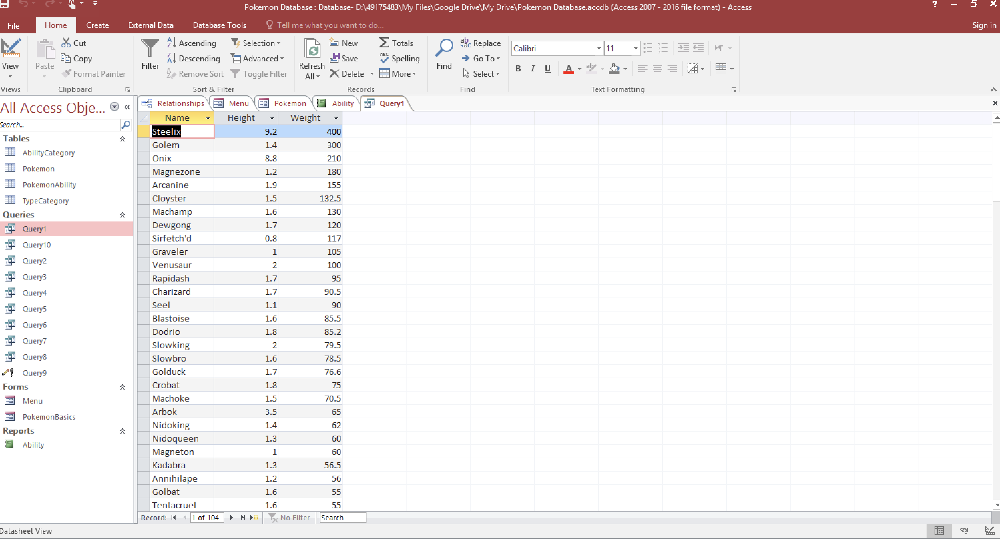
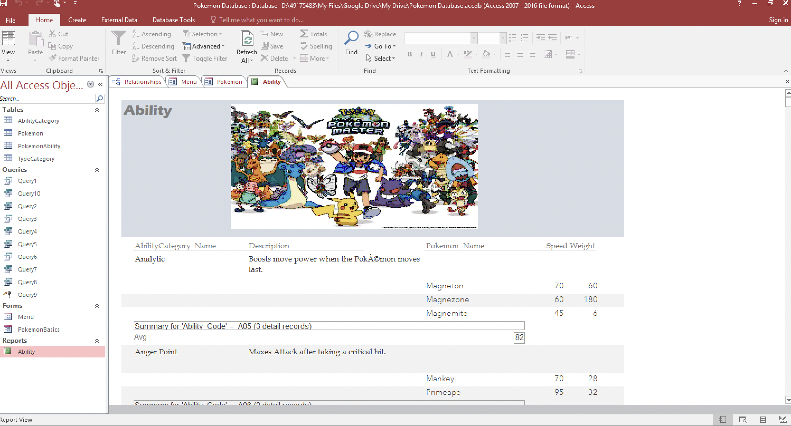

# PokemonDB

# 🧩 Pokémon Database Management System (Microsoft Access)

This project was for one of my classes in University. It's a complete relational database system built using **Microsoft Access**, designed to manage and explore a dataset of Pokémon, their types, and abilities. The database includes normalized tables, queries, forms, reports, and a navigation interface — ideal for showcasing fundamental database design and querying skills.

---

## 📁 Project Contents

### 1. **Tables**
- `Pokemon`: Stores core data like name, height, weight, base stats.
- `Type`: Contains Pokémon types (e.g. Fire, Water, Grass).
- `Ability`: Contains all available Pokémon abilities.
- `PokemonType`: Handles the many-to-many relationship between Pokémon and their types.
- `PokemonAbility`: Handles the many-to-many relationship between Pokémon and their abilities.

### 2. **Relationships**
- Fully normalized with **composite keys** in junction tables.
- **Referential integrity** enforced through foreign key constraints.
- ER-style relational schema implemented in Access Relationship view.

### 3. **Forms**
- `Add New Pokémon`: User-friendly form to enter new Pokémon data.
- `Ability Lookup`: Allows browsing ability descriptions.
- `Type Assignment`: Assign types to specific Pokémon.

### 4. **Queries**
- `Query1`: Retrieves and displays detailed Pokémon info, including name, type(s), and ability descriptions.
- Additional queries to find:
  - Pokémon with a specific ability.
  - Pokémon of a particular type.
  - Average base stats by type.

### 5. **Reports**
- `Pokemon Bios`: Printable report of selected Pokémon.
- `Ability Listings`: Lists all abilities and their descriptions.
- `Type Summary`: Breakdown of Pokémon by type.

---

## 🖼️ Screenshots

### 📌 Relationships View

### 📌 Navigation Form

### 📌 Pokémon Entry Form

### 📌 Query Output

### 📌 Pokémon Report

---

## 🎯 Features & Learning Outcomes

- ✅ **Relational database design** (normalization, foreign keys, composite keys).
- ✅ **User Interface development** with Access forms.
- ✅ **Query design** using Access Query Builder (SQL backend).
- ✅ **Data integrity enforcement** using validation rules and relationships.
- ✅ **Practical application** of database concepts to a familiar dataset.

---

## 🚀 How to Use

1. Open the `.accdb` file in **Microsoft Access** (Windows only).
2. Use the **Navigation Form** to explore Pokémon data via forms, reports, and queries.
3. Test queries manually, or run reports for a printable view.
4. View relationships under `Database Tools > Relationships`.

---

## 📎 Download

https://drive.google.com/file/d/18f4OD4xcqyF_bAXPOpW5Bq5mxUCh1AEj/view?usp=sharing 

---

## 🧠 Why Pokémon?

Using a familiar and structured dataset like Pokémon makes database learning intuitive and engaging. The project balances technical precision with creative exploration.

---

## 🔧 Tools Used

- Microsoft Access 365 (via Macquarie AppStream)
- Excel for data pre-processing
- Google Drive (for sharing)
